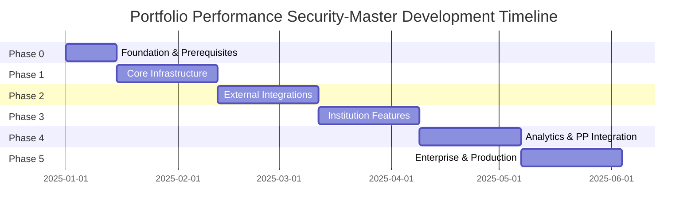
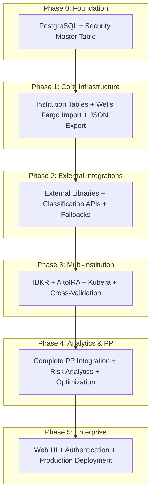

# Portfolio Performance Security-Master: Phase-Based Development Index

**Project**: Portfolio Performance Security-Master Service  
**Development Approach**: 6-Phase Incremental Delivery  
**Total Duration**: 22 weeks  
**Last Updated**: 2025-08-22  

---

## Quick Navigation

### 📋 Planning Documents
- **[Project Plan Review](project_plan_review.md)** - Comprehensive analysis and recommendations
- **[Revised Project Plan](revised_project_plan.md)** - Complete restructured plan with all phases
- **[Original Project Plan](../PROJECT_PLAN.md)** - Original 22.5-week linear plan

### 🏗️ Phase Documentation

**Phase 0: Foundation & Prerequisites (Weeks 1-2)**
- [Overview & Success Criteria](phase-0-foundation-overview.md)
- [Issues P0-001 to P0-005](phase-0-issues-P0-001-to-P0-005.md) - Infrastructure setup
- [Issues P0-006 to P0-010](phase-0-issues-P0-006-to-P0-010.md) - Development foundation
- [Completion Guide](phase-0-completion-guide.md) - Validation and troubleshooting

**Phase 1-4: Core Development**
- **[Phase 1: Core Infrastructure](phase-1-core-infrastructure.md)** - Weeks 3-6  
- **[Phase 2: External Integrations](phase-2-external-integrations.md)** - Weeks 7-10
- **[Phase 3: Institution Features](phase-3-institution-features.md)** - Weeks 11-14
- **[Phase 4: Analytics & PP Integration](phase-4-analytics-pp-integration.md)** - Weeks 15-18

**Phase 5: Enterprise & Production (Weeks 19-22)**
- [Prerequisites & Setup](phase-5-prerequisites-setup.md) - Steps 1-3
- [Production Deployment](phase-5-production-deployment.md) - Steps 4-7
- [Testing & Completion](phase-5-testing-completion.md) - Steps 8-10

### 📚 Architecture References
- **[ADRs Directory](../adr/)** - All Architecture Decision Records
- **[Original Project Plan](../PROJECT_PLAN.md)** - Complete technical specification

---

## Phase Overview & Critical Path

---

## Phase Summary

### Phase 0: Foundation & Prerequisites (Weeks 1-2)
**🎯 Goal**: Development environment and basic infrastructure  
**👥 Team**: 1-2 developers  
**📊 Success**: PostgreSQL operational, development workflow established

**Key Deliverables**:
- PostgreSQL 17 on Unraid with external access
- Security master table with comprehensive taxonomy
- Development tooling and quality controls
- Configuration and validation frameworks

**📋 Issues**: 10 issues (~25 hours total)
- P0-001: PostgreSQL 17 installation and configuration
- P0-002: Development environment standardization
- P0-003: Repository structure and standards
- P0-004: Core security master table schema
- P0-005: Alembic migration framework
- P0-006: Configuration system implementation
- P0-007: Database ORM layer
- P0-008: Development tooling integration
- P0-009: Data validation framework
- P0-010: Integration testing and validation

---

### Phase 1: Core Infrastructure (Weeks 3-6)  
**🎯 Goal**: Complete database schema and Wells Fargo import/export  
**👥 Team**: 2-3 developers  
**📊 Success**: Wells Fargo CSV → Database → JSON export working end-to-end

**Key Deliverables**:
- Institution-specific transaction tables
- Wells Fargo CSV import pipeline
- JSON export engine
- Data lineage and batch tracking
- Performance optimization for 10,000+ transactions

**📋 Issues**: 8 issues (~26 hours total)
- P1-001: Institution transaction tables schema
- P1-002: Data lineage and batch tracking
- P1-003: Wells Fargo CSV parser
- P1-004: Enhanced data quality validation
- P1-005: JSON export engine
- P1-006: Database performance optimization
- P1-007: Integration testing and error handling
- P1-008: Consolidated views and query interface

---

### Phase 2: External Integrations (Weeks 7-10)
**🎯 Goal**: External libraries and enhanced classification  
**👥 Team**: 2-3 developers  
**📊 Success**: >90% fund classification accuracy with fallback mechanisms

**Key Deliverables**:
- pp-portfolio-classifier and ppxml2db integration
- OpenFIGI API client with rate limiting
- Fund and equity classification pipelines
- Classification confidence scoring
- External service resilience patterns

**📋 Issues**: 6 issues (~20 hours total)
- P2-001: External repository integration
- P2-002: OpenFIGI API client
- P2-003: Fund classification pipeline  
- P2-004: Equity classification integration
- P2-005: Classification quality framework
- P2-006: External service resilience

---

### Phase 3: Institution Features (Weeks 11-14)
**🎯 Goal**: Multi-institution support with data validation  
**👥 Team**: 2-4 developers  
**📊 Success**: All four institutions operational with cross-validation

**Key Deliverables**:
- Interactive Brokers Flex Query parser
- AltoIRA PDF parsing with OCR
- Kubera API integration
- Cross-institution validation framework
- Advanced batch processing optimization

**📋 Issues**: 8 issues (~28 hours total)
- P3-001: IBKR Flex Query parser
- P3-002: AltoIRA PDF parser with OCR
- P3-003: Kubera API integration
- P3-004: Cross-institution validation
- P3-005: Batch processing optimization
- P3-006: Manual review workflow
- P3-007: Enhanced data lineage
- P3-008: Phase 3 integration testing

---

### Phase 4: Analytics & PP Integration (Weeks 15-18)
**🎯 Goal**: Complete PP integration and institutional analytics  
**👥 Team**: 3-4 developers  
**📊 Success**: Complete PP XML backup/restore and analytics operational

**Key Deliverables**:
- Complete Portfolio Performance XML export/import
- Risk-adjusted performance metrics
- Portfolio optimization algorithms
- Monte Carlo risk analysis
- Performance attribution analysis

**📋 Issues**: 8 issues (~30 hours total)
- P4-001: PP XML schema implementation
- P4-002: Bidirectional PP sync engine
- P4-003: Risk-adjusted performance metrics
- P4-004: Portfolio optimization algorithms
- P4-005: Monte Carlo risk analysis
- P4-006: Advanced export engine
- P4-007: Performance attribution analysis
- P4-008: Phase 4 integration testing

---

### Phase 5: Enterprise & Production (Weeks 19-22)
**🎯 Goal**: Production-ready system with UI and enterprise features  
**👥 Team**: 3-5 developers  
**📊 Success**: System operational with web UI and enterprise deployment

**Key Deliverables**:
- Web UI leveraging PromptCraft Gradio patterns and components
- Cloudflare tunnel and authentication integration (reuse existing infrastructure)
- Production deployment automation (adapt PromptCraft patterns)
- Monitoring, logging, and alerting
- Complete documentation and training

**📋 Issues**: 9 issues (~30 hours total - reduced through PromptCraft asset reuse)**

**PromptCraft Integration Benefits**:
- **Proven UI patterns**: Reuse multi-journey interface and accessibility components
- **Established authentication**: Leverage existing Cloudflare Access and JWT validation
- **Deployment patterns**: Adapt proven containerization and configuration management
- **Reduced development effort**: ~6 hours saved through component reuse
- P5-001: Web UI framework and interface
- P5-002: Authentication and authorization
- P5-003: Production deployment automation
- P5-004: Monitoring and alerting infrastructure
- P5-005: Security hardening and assessment
- P5-006: Performance optimization and load testing
- P5-007: Documentation and training materials
- P5-008: User acceptance testing and validation

---

## Project Metrics Summary

### Development Metrics
- **Total Issues**: 56 issues across all phases
- **Total Estimated Effort**: ~160 developer hours
- **Average Issue Size**: 2.9 hours (within 2-4 hour target)
- **Team Scaling**: 1-2 → 5 developers across phases

### Success Criteria Progression

| Phase | Key Success Metric | Target | Validation Method |
|-------|-------------------|--------|------------------|
| **Phase 0** | Development environment operational | <30 min setup | New developer onboarding |
| **Phase 1** | Wells Fargo end-to-end working | 1000+ transactions | CSV import → JSON export |
| **Phase 2** | Fund classification accuracy | >90% accuracy | Test dataset validation |
| **Phase 3** | Multi-institution operational | All 4 institutions | Cross-validation testing |
| **Phase 4** | Complete PP integration | 30-second backups | Round-trip validation |
| **Phase 5** | Production system ready | <1% error rate | User acceptance testing |

### Technical Architecture Evolution

---

## Risk Management and Dependencies

### Critical Dependencies

#### Phase 0 → Phase 1
- PostgreSQL 17 operational and accessible
- Development environment standardized across team
- Security master table schema validated

#### Phase 1 → Phase 2
- Single institution (Wells Fargo) data pipeline working
- Database performance validated with production-like volumes
- Export framework operational

#### Phase 2 → Phase 3
- External library integrations secure and functional
- Classification accuracy benchmarks established
- API rate limiting and fallback mechanisms operational

#### Phase 3 → Phase 4
- Multi-institution data validation working
- Data quality metrics showing improvement
- System scalability demonstrated

#### Phase 4 → Phase 5
- Complete Portfolio Performance integration validated
- Analytics calculations accurate and performant
- Data sovereignty achieved

### Risk Mitigation by Phase

#### High-Impact Risks
- **Database Performance Issues** (Phase 1-3): Continuous performance testing, query optimization
- **External Service Dependencies** (Phase 2-4): Circuit breakers, fallback mechanisms, caching
- **Data Quality Problems** (Phase 3-5): Multi-layer validation, cross-institution verification

#### Medium-Impact Risks
- **Integration Complexity** (All phases): Comprehensive testing, clear interfaces
- **Scope Creep** (Phase 4-5): Clear phase boundaries, change control process

---

## Quality Assurance Framework

### Testing Strategy by Phase

#### Unit Testing (All Phases)
- **Target**: >80% code coverage
- **Focus**: Individual component functionality
- **Automation**: Pre-commit hooks and CI/CD pipeline

#### Integration Testing (Phase 1+)
- **Target**: End-to-end workflow validation
- **Focus**: Cross-component interactions
- **Automation**: Phase completion gates

#### Performance Testing (Phase 1+)
- **Target**: <2s response times, handle 10,000+ transactions
- **Focus**: Database operations, large dataset processing
- **Automation**: Continuous performance monitoring

#### User Acceptance Testing (Phase 5)
- **Target**: >4.5/5 user satisfaction
- **Focus**: Real user workflows and scenarios
- **Validation**: End-user feedback and adoption metrics

### Code Quality Standards
- **Formatting**: Black (88-character line length)
- **Linting**: Ruff with comprehensive rule set
- **Type Checking**: MyPy in strict mode
- **Security**: Bandit static analysis, dependency scanning
- **Documentation**: All public APIs documented

---

## Team Structure and Responsibilities

### Core Team Roles

#### Technical Lead (All Phases)
- Architecture decisions and technical direction
- Code review and quality standards
- Cross-phase coordination and planning

#### Backend Developers (Phase 0-4)
- Database design and optimization
- API development and integration
- Data processing and validation

#### Frontend Developer (Phase 5)
- Web UI development and user experience
- React/TypeScript implementation
- Mobile-responsive design

#### DevOps Engineer (Phase 5)
- Production deployment automation
- Monitoring and alerting infrastructure
- Security hardening and compliance

#### QA Engineer (Phase 1+)
- Test strategy and automation
- Performance and security testing
- User acceptance testing coordination

### Team Scaling Timeline

| Phase | Team Size | Key Roles | Focus Areas |
|-------|-----------|-----------|-------------|
| **Phase 0** | 1-2 | Tech Lead + Backend | Foundation and environment |
| **Phase 1** | 2-3 | + Database Developer | Core infrastructure |
| **Phase 2** | 2-3 | + Integration Specialist | External services |
| **Phase 3** | 2-4 | + Data Engineer | Multi-institution support |
| **Phase 4** | 3-4 | + Analytics Developer | Advanced features |
| **Phase 5** | 3-5 | + Frontend + DevOps + QA | Production readiness |

---

## Success Metrics and Monitoring

### Business Impact Metrics

#### Efficiency Gains
- **Manual Classification Reduction**: Target >80% reduction in manual effort
- **Data Processing Speed**: 10,000+ transactions processed in <30 seconds
- **Classification Accuracy**: >95% for listed securities, >90% for complex instruments

#### Quality Improvements
- **Data Consistency**: Cross-institution validation identifies >95% of discrepancies
- **Error Rates**: <1% system error rate under production load
- **User Satisfaction**: >4.5/5 rating in user acceptance testing

### Technical Health Metrics

#### Performance
- **Response Times**: <2s for database operations, <30s for complete processing
- **Scalability**: System handles 100,000+ transactions without architectural changes
- **Reliability**: >99.5% uptime with automated failover

#### Quality
- **Code Coverage**: >80% across all components
- **Security**: Zero high-severity vulnerabilities
- **Documentation**: Complete coverage of all user and developer workflows

---

## Project Completion and Success Validation

### Phase Completion Gates

Each phase must meet specific completion criteria before proceeding:

1. **All phase issues completed** and validated
2. **Success criteria achieved** and documented
3. **Quality gates passed** (coverage, performance, security)
4. **Stakeholder acceptance** and sign-off
5. **Next phase readiness** confirmed

### Final Success Validation

#### Technical Excellence
- Complete end-to-end system functional from institution import to PP export
- Performance targets met across all major workflows
- Security and compliance requirements satisfied
- Code quality and documentation standards maintained

#### Business Value
- Portfolio Performance transformed from desktop tool to enterprise platform  
- Manual effort reduced by >80% through automated classification
- Data quality and consistency improved through systematic validation
- Institutional-grade analytics provide advanced portfolio insights

#### Operational Excellence
- Production deployment stable and monitored
- User adoption successful with positive feedback
- Documentation enables self-service support
- System maintainable by operations team

---

**Project Vision Achieved**: Transform Portfolio Performance into an enterprise-grade financial data platform with automated classification, institutional analytics, and complete data sovereignty.

**Next Steps**: Begin Phase 0 execution with PostgreSQL installation and development environment setup.

---

*This index provides complete navigation and overview of the restructured Portfolio Performance Security-Master project. Each phase document contains detailed issue breakdowns with 2-4 hour scoped work items, comprehensive acceptance criteria, and testing requirements.*