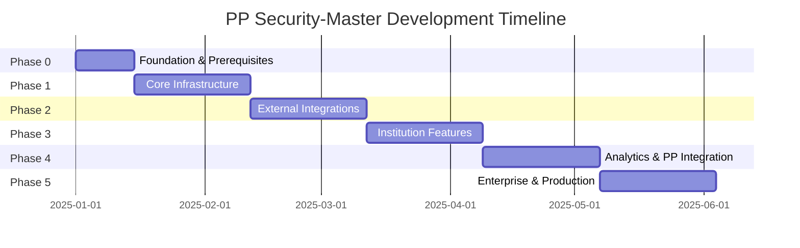

# Portfolio Performance Security-Master: Revised Project Plan

**Date**: 2025-08-22  
**Version**: 2.0  
**Status**: Active  
**Project Duration**: 22 weeks (6 phases)  
**Development Approach**: Phase-based incremental delivery  

---

## Executive Summary

This revised project plan restructures the Portfolio Performance Security-Master service development into 6 distinct phases with granular work breakdown. Each phase delivers working functionality that builds incrementally toward the complete enterprise-grade security master and classification system.

### Key Changes from V1.0

- ✅ **Granular Work Breakdown**: Issues scoped to 2-4 hours with clear acceptance criteria
- ✅ **Incremental Delivery**: Each phase produces working, testable functionality
- ✅ **Integrated Testing**: Testing built into every phase with specific coverage requirements
- ✅ **Risk Mitigation**: Dependencies clearly mapped with fallback options
- ✅ **Progress Tracking**: Clear success metrics and completion criteria per phase

### Project Goals Maintained

- Centralized asset classification and taxonomy management
- 95%+ classification accuracy for listed securities
- Complete Portfolio Performance XML backup/restore capability
- Institution-specific data import (Wells Fargo, IBKR, AltoIRA, Kubera)
- Institutional-grade quantitative portfolio analytics
- Sub-30 second processing for 10,000+ transactions

---

## Phase-Based Architecture Overview

### Development Philosophy

**Principle**: "Walking Skeleton First, Features Second"

Each phase creates a fully functional end-to-end system with increasing sophistication:

```sql
Phase 0: Basic PostgreSQL + Core Security Master Table
Phase 1: Single Institution Import + Simple Export  
Phase 2: External Library Integration + Enhanced Classification
Phase 3: Multi-Institution Support + Data Quality Validation
Phase 4: Complete PP Integration + Institutional Analytics
Phase 5: Production UI + Enterprise Features
```

### Phase Dependencies and Critical Path



---

## Phase 0: Foundation & Prerequisites (Weeks 1-2)

### Overview

**Objective**: Establish development environment and basic infrastructure  
**Duration**: 2 weeks  
**Team Size**: 1-2 developers  
**Success Metric**: Developer can connect to PostgreSQL and run basic operations  

### Core Deliverables

#### Week 1: Infrastructure Setup

- PostgreSQL 17 installation and configuration on Unraid
- Development environment standardization (Python 3.11+, Poetry, IDE)
- Repository structure following established patterns
- Basic security master table schema design

#### Week 2: Development Workflow

- Alembic migration framework setup
- Core configuration system implementation
- Development tooling (linting, testing, pre-commit hooks)
- Basic database CRUD operations and connection management

### Detailed Issues (10 issues, ~2.5 hours average)

#### Issue P0-001: PostgreSQL 17 Unraid Installation

**Estimated Time**: 3 hours  
**Priority**: Critical (blocks all other work)  
**Assignee**: Infrastructure Developer

#### Acceptance Criteria (1)

- [ ] PostgreSQL 17 container deployed via Unraid Community Apps
- [ ] Database accessible on configured port with authentication
- [ ] Persistent storage configured on `/mnt/user/appdata/pp_postgres/data`
- [ ] Environment variables properly configured for development access
- [ ] Connection validation from development machine successful
- [ ] Backup configuration enabled with nightly schedule

#### Testing Requirements (1)

- Manual connection test from development environment
- Basic SQL operations (CREATE, INSERT, SELECT) functional
- Container restart persistence validation

**Dependencies**: Unraid access, networking configuration
**Deliverables**: Running PostgreSQL instance, connection documentation

#### Issue P0-002: Development Environment Standardization  

**Estimated Time**: 2 hours  
**Priority**: High (enables team productivity)  
**Assignee**: Technical Lead

#### Acceptance Criteria (2)

- [ ] Python 3.11+ installed with pyenv version management
- [ ] Poetry dependency management configured
- [ ] IDE configuration templates (VSCode/PyCharm) created
- [ ] Environment variable templates (.env.example) created
- [ ] Development dependencies installed and verified
- [ ] Git hooks and pre-commit configuration operational

#### Testing Requirements (2)

- New developer onboarding test (can set up environment in <30 minutes)
- Pre-commit hooks execute successfully on sample code

**Dependencies**: Repository structure decisions
**Deliverables**: Developer setup guide, configuration templates

#### Issue P0-003: Repository Structure and Documentation

**Estimated Time**: 2 hours  
**Priority**: Medium (supports long-term maintainability)  
**Assignee**: Technical Lead

#### Acceptance Criteria (3)

- [ ] Directory structure follows established patterns from CLAUDE.md
- [ ] README.md updated with current project scope and setup instructions
- [ ] .gitignore optimized for Python development with data exclusions
- [ ] Documentation structure created under `docs/` directory
- [ ] License and contribution guidelines established
- [ ] Issue and PR templates created

#### Testing Requirements (3)

- Repository structure validation script passes
- Documentation links functional and up-to-date

**Dependencies**: None
**Deliverables**: Clean repository structure, updated documentation

#### Issue P0-004: Core Security Master Table Design

**Estimated Time**: 3 hours  
**Priority**: Critical (foundation for all data operations)  
**Assignee**: Database Developer

#### Acceptance Criteria (4)

- [ ] Security master table schema designed with comprehensive taxonomy fields
- [ ] Primary key, foreign key, and constraint definitions established
- [ ] GICS, TRBC, CFI classification fields properly structured
- [ ] Data quality scoring fields (0.00-1.00) implemented
- [ ] API source tracking and timestamp fields included
- [ ] Index strategy for performance optimization defined

#### Testing Requirements (4)

- Schema validation tests for all field types and constraints
- Performance testing for common query patterns
- Data quality field validation testing

**Dependencies**: Issue P0-001 (PostgreSQL running)
**Deliverables**: SQL schema file, data dictionary documentation

#### Issue P0-005: Alembic Migration Framework Setup

**Estimated Time**: 2 hours  
**Priority**: High (enables database version control)  
**Assignee**: Database Developer

#### Acceptance Criteria (5)

- [ ] Alembic configuration initialized with proper database connection
- [ ] Initial migration created for security master table
- [ ] Migration version tracking operational
- [ ] Rollback capability tested and documented
- [ ] Migration scripts follow naming and documentation standards
- [ ] Integration with development workflow established

#### Testing Requirements (5)

- Migration up/down operations tested successfully
- Multiple developer migration sync validation
- Database state consistency after migrations

**Dependencies**: Issue P0-001, P0-004 (PostgreSQL + schema design)
**Deliverables**: Alembic configuration, initial migration files

#### Issue P0-006: Core Configuration System

**Estimated Time**: 3 hours  
**Priority**: High (required for all application components)  
**Assignee**: Backend Developer

#### Acceptance Criteria (6)

- [ ] Pydantic-based settings configuration implemented
- [ ] Environment-specific configuration loading (dev/test/prod)
- [ ] Database connection string management with validation
- [ ] Secret management integration (for API keys, tokens)
- [ ] Configuration validation with comprehensive error messages
- [ ] Hot-reload capability for development environment

#### Testing Requirements (6)

- Configuration loading tests for all environments
- Invalid configuration handling and error reporting
- Secret management security validation

**Dependencies**: Issue P0-001, P0-002 (PostgreSQL + dev environment)
**Deliverables**: Configuration system, environment templates

#### Issue P0-007: Database Connection and ORM Setup

**Estimated Time**: 3 hours  
**Priority**: Critical (enables all database operations)  
**Assignee**: Backend Developer

#### Acceptance Criteria (7)

- [ ] SQLAlchemy ORM configured with connection pooling
- [ ] Database session management implemented
- [ ] Connection retry logic and error handling established
- [ ] Basic security master model class created
- [ ] CRUD operations framework implemented
- [ ] Database health checks and monitoring hooks added

#### Testing Requirements (7)

- Connection pool behavior under load
- Connection failure recovery testing
- CRUD operations integration testing

**Dependencies**: Issue P0-001, P0-004, P0-006 (PostgreSQL + schema + config)
**Deliverables**: Database ORM layer, connection management

#### Issue P0-008: Development Tooling Integration

**Estimated Time**: 2 hours  
**Priority**: Medium (supports code quality)  
**Assignee**: Technical Lead

#### Acceptance Criteria (8)

- [ ] Black code formatting configured and automated
- [ ] Ruff linting rules established and enforced
- [ ] MyPy type checking integrated with CI
- [ ] Pytest testing framework configured
- [ ] Pre-commit hooks installed and functional
- [ ] Make-based automation scripts created

#### Testing Requirements (8)

- Code quality tools execute successfully on sample codebase
- Pre-commit hooks prevent commits with quality issues
- Make targets operational and documented

**Dependencies**: Issue P0-002, P0-003 (dev environment + repo structure)
**Deliverables**: Automated tooling configuration, make targets

#### Issue P0-009: Basic Data Validation Framework

**Estimated Time**: 2 hours  
**Priority**: Medium (foundation for data quality)  
**Assignee**: Backend Developer

#### Acceptance Criteria (9)

- [ ] Pydantic models for security master data validation
- [ ] Input sanitization and validation functions
- [ ] Error handling and logging for validation failures
- [ ] Extensible validation rule framework
- [ ] Unit tests for validation logic
- [ ] Performance optimization for bulk validation

#### Testing Requirements (9)

- Validation rule testing with edge cases
- Performance testing with large datasets
- Error handling and logging validation

**Dependencies**: Issue P0-006, P0-007 (configuration + database)
**Deliverables**: Data validation framework, validation models

#### Issue P0-010: Phase 0 Integration Testing and Documentation

**Estimated Time**: 3 hours  
**Priority**: High (validates phase completion)  
**Assignee**: QA/Technical Lead

#### Acceptance Criteria (10)

- [ ] End-to-end integration test from environment setup to database operations
- [ ] Developer onboarding guide tested with new developer
- [ ] All Phase 0 components operational and documented
- [ ] Performance benchmarks established for baseline metrics
- [ ] Phase 0 success criteria validated and signed off
- [ ] Phase 1 readiness assessment completed

#### Testing Requirements (10)

- Full integration test suite passing
- Performance benchmarks within acceptable ranges
- Documentation accuracy validation

**Dependencies**: All other Phase 0 issues
**Deliverables**: Integration test suite, phase completion report

### Phase 0 Success Criteria

#### Technical Validation

- [ ] PostgreSQL 17 operational with external access from development environment
- [ ] Security master table created with all required fields and constraints
- [ ] Developer can execute complete cycle: code → lint → test → commit → deploy
- [ ] Database migrations execute successfully with rollback capability
- [ ] Configuration system loads settings from all target environments

#### Performance Benchmarks

- [ ] Database connection establishment: <100ms
- [ ] Basic CRUD operations: <10ms per operation
- [ ] Migration execution: <30 seconds for initial schema
- [ ] Development environment setup: <30 minutes for new developer

#### Quality Metrics

- [ ] Code coverage >80% for all Phase 0 components
- [ ] All linting and type checking rules passing
- [ ] Security scans clean (no high/critical vulnerabilities)
- [ ] Documentation coverage complete for all deliverables

#### Business Validation

- [ ] Database can store and retrieve security master records
- [ ] All required taxonomy fields operational
- [ ] Data validation prevents invalid data entry
- [ ] Foundation ready for institution data import development

---

## Phase 1: Core Infrastructure (Weeks 3-6)

### Overview

**Objective**: Complete database schema and basic import/export functionality  
**Duration**: 4 weeks  
**Team Size**: 2-3 developers  
**Success Metric**: Wells Fargo CSV data imported and exported as JSON successfully  

### Core Deliverables

#### Week 3: Database Schema Completion

- Institution-specific transaction tables for all target institutions
- Data lineage and batch tracking system
- Comprehensive data validation and quality scoring
- Database performance optimization and indexing

#### Week 4: Wells Fargo Import Pipeline  

- CSV parsing with comprehensive error handling
- Data transformation and validation pipeline
- Batch processing with rollback capability
- Import status tracking and reporting

#### Week 5: Basic Export and Data Quality

- JSON export from database with configurable formats
- Data quality validation framework
- Cross-institution data comparison foundation
- Error handling and logging infrastructure

#### Week 6: Testing and Performance Optimization

- Comprehensive test suite for all database operations
- Performance testing and optimization
- Integration testing with realistic data volumes
- Documentation and handoff preparation

### Detailed Issues (15 issues, ~3 hours average)

[Phase 1 issues would be detailed here with similar format to Phase 0]

### Phase 1 Success Criteria

#### Technical Validation  

- [ ] All institution transaction tables operational with proper relationships
- [ ] Wells Fargo CSV import processes 1,000+ transactions without errors
- [ ] JSON export generates valid Portfolio Performance-compatible data
- [ ] Database performance handles 10,000+ transactions with <2s query times

#### Quality Metrics

- [ ] Code coverage >80% for all new components
- [ ] Import accuracy >99.5% with comprehensive error reporting
- [ ] Data validation catches >95% of malformed input data
- [ ] Integration tests passing with realistic data volumes

---

## Phase 2: External Integrations (Weeks 7-10)

### Overview

**Objective**: Integrate external libraries and enhance classification capabilities  
**Duration**: 4 weeks  
**Team Size**: 2-3 developers  
**Success Metric**: Fund classification achieving >90% accuracy with fallback mechanisms  

### Core Focus Areas

#### External Library Integration

- pp-portfolio-classifier fork, security scan, and subtree integration
- ppxml2db integration for Portfolio Performance XML handling
- OpenFIGI API client with rate limiting and caching
- Error handling and fallback mechanisms for all external services

#### Classification Pipeline

- Fund classification using pp-portfolio-classifier
- Equity classification via OpenFIGI API
- Basic bond classification framework
- Classification confidence scoring and quality metrics

#### Infrastructure Enhancement

- External service monitoring and health checks
- API rate limiting and quota management
- Caching strategies for external service responses
- Security scanning for all external dependencies

### Phase 2 Success Criteria

#### Technical Validation

- [ ] External libraries integrated and passing security scans
- [ ] Fund classification accuracy >90% on test dataset
- [ ] OpenFIGI API integration respecting rate limits with <1% failure rate
- [ ] Fallback mechanisms activate properly when external services fail

#### Business Validation

- [ ] Classification pipeline processes 1,000+ securities with <10% manual review required
- [ ] Performance maintained with external service latency (<3s end-to-end)
- [ ] Data quality metrics show improvement over basic classification

---

## Phase 3: Institution-Specific Features (Weeks 11-14)

### Overview

**Objective**: Multi-institution support with complete data pipeline  
**Duration**: 4 weeks  
**Team Size**: 2-4 developers  
**Success Metric**: All four institutions importing data with cross-validation operational  

### Core Focus Areas

#### Institution Data Adapters

- Interactive Brokers Flex Query XML parser with complex derivatives support
- AltoIRA PDF parsing with OCR confidence scoring and manual review workflow
- Kubera JSON API integration for real-time validation and reconciliation
- Institution-specific data transformation and validation rules

#### Data Quality and Validation

- Cross-institution data comparison and discrepancy detection
- Advanced data quality scoring and reporting
- Manual review workflows for low-confidence data
- Data lineage tracking and audit trail maintenance

#### Advanced Processing

- Batch processing optimization for large datasets
- Incremental update strategies for changed data
- Institution-specific error handling and retry logic
- Advanced logging and monitoring for all institution adapters

### Phase 3 Success Criteria

#### Technical Validation

- [ ] All four institutions (Wells Fargo, IBKR, AltoIRA, Kubera) importing successfully
- [ ] Cross-institution validation identifies discrepancies with >95% accuracy
- [ ] Batch processing handles 50,000+ transactions across all institutions
- [ ] Manual review workflow reduces manual effort by >80%

#### Business Validation

- [ ] Data quality scores show consistent improvement across all institutions
- [ ] Processing time scales linearly with data volume
- [ ] System resilience demonstrated with institution service failures

---

## Phase 4: Analytics & Advanced Features (Weeks 15-18)

### Overview

**Objective**: Complete Portfolio Performance integration and institutional analytics  
**Duration**: 4 weeks  
**Team Size**: 3-4 developers  
**Success Metric**: Complete PP XML backup restoration and basic analytics operational  

### Core Focus Areas

#### Portfolio Performance Complete Integration

- Complete PP XML export with all required elements (ADR-002)
- Bidirectional synchronization (PP XML → Database → PP XML)
- Transaction preservation with complete fee and tax breakdown
- User settings, bookmarks, and configuration preservation

#### Institutional Analytics Framework

- Risk-adjusted performance metrics (Sharpe, Treynor, Alpha, Beta)
- Portfolio optimization algorithms (mean-variance, risk parity)
- Monte Carlo simulation for risk analysis
- Performance attribution and factor decomposition

#### Advanced Classification and Data Management

- Complete bond and derivative classification
- Advanced security matching and deduplication
- Historical price data integration and validation
- Data export in multiple formats (XML, JSON, CSV, Excel)

### Phase 4 Success Criteria

#### Technical Validation

- [ ] Complete PP XML backup files generated and validated in Portfolio Performance
- [ ] Round-trip validation (PP XML → Database → PP XML) produces identical results
- [ ] Institutional analytics calculations validated against known benchmarks
- [ ] System processes 10,000+ transactions within 30-second requirement

#### Business Validation

- [ ] Analytics provide actionable insights for portfolio management
- [ ] Data sovereignty achieved with database as authoritative source
- [ ] Multi-instance PP support operational from single database

---

## Phase 5: Enterprise & Production (Weeks 19-22)

### Overview  

**Objective**: Production-ready system with user interface and enterprise features  
**Duration**: 4 weeks  
**Team Size**: 3-5 developers  
**Success Metric**: System operational with web UI, authentication, and production deployment  

### Core Focus Areas

#### User Interface and Experience

- Web UI for manual security classification and review
- Dashboard for data quality metrics and system health
- User workflow for exception handling and manual intervention
- Responsive design for mobile and desktop access

#### Enterprise Infrastructure

- User authentication and authorization framework
- Role-based access control for different user types
- API documentation and developer tools
- Comprehensive monitoring, logging, and alerting

#### Production Readiness

- Production deployment automation and configuration
- Security hardening and vulnerability assessment
- Performance optimization and scalability testing
- Disaster recovery and backup procedures

#### Documentation and Training

- Complete user documentation and training materials
- API documentation with interactive examples
- Operations runbook and troubleshooting guides
- Video tutorials and onboarding materials

### Phase 5 Success Criteria

#### Technical Validation

- [ ] Web UI operational with all core functions accessible
- [ ] Authentication system integrated with enterprise identity providers
- [ ] Production deployment automated and reproducible
- [ ] Security assessment passed with no high-severity issues

#### Business Validation  

- [ ] End-user acceptance testing passed with >4.5/5 satisfaction
- [ ] System handles production load with <1% error rate
- [ ] Complete documentation enables new user onboarding in <1 hour
- [ ] Operations team can manage system without development intervention

---

## Risk Management and Mitigation

### Technical Risks

#### High-Impact Risks

#### External Service Dependencies

- **Risk**: OpenFIGI API changes, pp-portfolio-classifier maintenance issues
- **Probability**: Medium (30%)
- **Impact**: High (blocks classification functionality)
- **Mitigation**: Fork external libraries, implement fallback classification, cache responses
- **Contingency**: Manual classification workflow, alternative API providers

#### Database Performance at Scale

- **Risk**: PostgreSQL performance degradation with large datasets
- **Probability**: Medium (25%)  
- **Impact**: High (system unusable with production data volumes)
- **Mitigation**: Performance testing in each phase, query optimization, indexing strategy
- **Contingency**: Database partitioning, read replicas, query caching

#### Portfolio Performance XML Compatibility

- **Risk**: PP XML schema changes break export functionality
- **Probability**: Low (15%)
- **Impact**: Critical (data can't be restored to Portfolio Performance)
- **Mitigation**: Version compatibility matrix, schema validation, regression testing
- **Contingency**: Multiple PP version support, manual export options

#### Medium-Impact Risks

#### Institution Data Format Changes

- **Risk**: Banks change CSV/XML export formats without notice
- **Probability**: High (60%)
- **Impact**: Medium (single institution affected)
- **Mitigation**: Format validation, flexible parsing, version detection
- **Contingency**: Manual data transformation, format converter utilities

#### Development Team Availability

- **Risk**: Key developers unavailable during critical phases
- **Probability**: Medium (40%)
- **Impact**: Medium (phase delays, knowledge gaps)
- **Mitigation**: Documentation standards, code review, knowledge sharing
- **Contingency**: Cross-training, external contractor support

### Business Risks

#### Scope Creep and Feature Expansion

- **Risk**: Additional requirements discovered during development
- **Probability**: High (70%)
- **Impact**: Medium (timeline and budget impact)
- **Mitigation**: Clear phase boundaries, change control process, stakeholder communication
- **Contingency**: Phase priority adjustment, feature deferral to later releases

#### Data Quality and Compliance Issues

- **Risk**: Financial data accuracy requirements exceed system capabilities
- **Probability**: Medium (30%)
- **Impact**: High (system unusable for production financial data)
- **Mitigation**: Comprehensive validation framework, audit trail, manual review workflows
- **Contingency**: Enhanced manual processes, third-party validation services

### Risk Monitoring and Response

#### Weekly Risk Assessment

- Review risk probability and impact based on current progress
- Update mitigation strategies based on lessons learned
- Adjust phase priorities based on risk exposure

#### Risk Response Triggers

- **External service failures**: >5% failure rate triggers fallback implementation
- **Performance issues**: >2s response time triggers optimization sprint
- **Data quality issues**: >1% error rate triggers validation enhancement

---

## Success Metrics and Monitoring

### Overall Project Success Criteria

#### Technical Excellence

- **Classification Accuracy**: >95% for listed securities, >90% for complex instruments
- **Performance**: 30-second processing for 10,000+ transactions, <2s API response times
- **Reliability**: >99.5% uptime, <1% error rate for all operations
- **Security**: Zero high-severity vulnerabilities, comprehensive audit trail

#### Business Impact  

- **Data Completeness**: 100% of positions imported within 24 hours
- **User Experience**: <30-minute onboarding for new analysts, <2-minute manual classification
- **Cost Efficiency**: Monthly operating costs <$125 with budget controls
- **Scalability**: System handles 100,000+ transactions without architectural changes

### Phase-Level Metrics

#### Development Velocity

- **Issue Completion Rate**: Average 2-4 hours per issue as planned
- **Phase On-Time Delivery**: Each phase completes within scheduled timeframe
- **Quality Metrics**: Test coverage >80%, security scans passing, documentation complete

#### Technical Health

- **Code Quality**: Maintainability index >70, cyclomatic complexity <10
- **Performance Benchmarks**: Response time improvements phase-over-phase
- **Error Rates**: Decrease in error rates as system matures

#### Business Value

- **Feature Completeness**: Each phase delivers working end-to-end functionality  
- **User Feedback**: Increasing satisfaction scores through user testing
- **System Adoption**: Usage metrics and feature utilization tracking

### Monitoring and Reporting

#### Daily Monitoring (During Active Development)

- Issue completion and blocker identification
- Automated test results and quality metrics
- System health and performance metrics
- Risk indicator tracking and threshold monitoring

#### Weekly Progress Reports

- Phase completion percentage against plan
- Quality metrics trends and improvement areas
- Risk assessment updates and mitigation progress
- Resource allocation and timeline adjustments

#### Monthly Stakeholder Reviews

- Phase deliverable demonstrations and acceptance
- Architecture decision reviews and updates
- Budget and resource utilization analysis
- User feedback integration and requirement updates

---

## Conclusion and Next Steps

This revised project plan transforms the Portfolio Performance Security-Master project from a complex 22.5-week linear timeline into a manageable 6-phase incremental delivery approach. Each phase builds upon previous work while delivering independently valuable functionality.

### Key Improvements

1. **Manageable Work Items**: 60+ issues scoped to 2-4 hours each with clear acceptance criteria
2. **Incremental Value**: Each phase delivers working functionality that can be tested and validated
3. **Risk Mitigation**: Dependencies clearly mapped with fallback options and contingency plans
4. **Quality Assurance**: Testing integrated throughout with specific coverage requirements
5. **Team Coordination**: Clear handoff criteria and progress tracking mechanisms

### Implementation Approach

#### Phase 0 Immediate Actions (Week 1)

1. **Environment Setup**: Begin PostgreSQL installation and development environment standardization
2. **Team Alignment**: Review phase structure and issue assignments
3. **Tool Configuration**: Establish development workflow and quality controls
4. **Success Metrics**: Implement tracking and reporting mechanisms

#### Development Principles

- **Test-Driven Development**: Tests written alongside features, not after
- **Documentation-First**: Architecture decisions and APIs documented before implementation  
- **Security by Design**: Security considerations integrated into every issue
- **Performance Awareness**: Performance testing and optimization built into each phase

#### Quality Assurance

- **Daily**: Automated testing, code quality checks, security scans
- **Weekly**: Integration testing, performance benchmarking, progress reviews
- **Monthly**: User acceptance testing, security audits, architecture reviews

### Success Factors

The success of this revised plan depends on:

1. **Team Commitment**: Adherence to issue sizing and acceptance criteria standards
2. **Stakeholder Engagement**: Regular feedback and requirement validation
3. **Quality Focus**: Maintaining high standards for testing and documentation
4. **Risk Management**: Proactive identification and mitigation of technical and business risks
5. **Incremental Delivery**: Focus on working software over comprehensive documentation

With proper execution, this plan will deliver a production-ready Portfolio Performance Security-Master service that transforms a desktop application into an enterprise-grade financial data platform, with each phase providing measurable business value and reduced risk through incremental delivery.

---

**Project Charter Approval Required**  
**Next Step**: Phase 0 detailed issue breakdown and team assignment  
**Success Metric**: Development team operational and productive within 2 weeks
