# Security Master Database Schema

```mermaid
erDiagram
    SECURITIES_MASTER {
        int id PK "Auto-increment primary key"
        varchar name "Security name (required)"
        varchar isin UK "International Securities ID"
        varchar symbol "Trading symbol/ticker"
        varchar wkn "German securities identifier"
        text note "Additional notes"
        varchar currency "Currency code (default USD)"
        decimal latest_price "Current market price"
        decimal delta_percent "Price change %"
        decimal delta_amount "Price change amount"
        date latest_date "Date of latest price"
        date last_historical_date "Last historical data"
        date first_historical_date "First historical data"
        varchar quote_feed_historic "Historical data source"
        varchar quote_feed_latest "Latest price source"
        varchar url_historic_quotes "Historical quotes URL"
        varchar url_latest_quotes "Latest quotes URL"
        date next_ex_date "Next ex-dividend date"
        date next_payment_date "Next dividend payment"
        decimal next_payment_amount "Next dividend amount"
        varchar logo "Logo URL"
        decimal ter "Total Expense Ratio"
        decimal aum "Assets Under Management"
        varchar vendor "Fund company/vendor"
        decimal acquisition_fee "Acquisition fee"
        decimal management_fee "Management fee"
        varchar asset_classes_level1 "Top-level asset class"
        varchar asset_classes "Detailed asset classes"
        varchar sector "Industry sector"
        varchar industry_group "Industry group"
        varchar industry "Industry"
        varchar industries_gics_level4 "GICS Level 4"
        varchar industries_gics "All GICS industries"
        varchar industries_gics_sectors_level1 "GICS top sectors"
        varchar industries_gics_sectors "All GICS sectors"
        varchar asset_allocation_level1 "Asset allocation L1"
        varchar asset_allocation_level2 "Asset allocation L2"
        varchar asset_allocation "Full asset allocation"
        varchar market "Primary trading market"
        varchar region "Geographic region"
        varchar regions_msci_level3 "MSCI Level 3 regions"
        varchar regions_msci "All MSCI regions"
        varchar type_of_security_level1 "Top security type"
        varchar type_of_security "Detailed security type"
        varchar brx_plus_level1 "Byron custom Level 1"
        varchar brx_plus_level2 "Byron custom Level 2"
        varchar brx_plus "Byron custom full"
        timestamp created_at "Record creation"
        timestamp updated_at "Last update"
        varchar data_source "Source system"
        decimal data_quality_score "Quality score 0.00-1.00"
    }

    KUBERA_SHEETS {
        int id PK "Auto-increment primary key"
        varchar sheet_id UK "Kubera sheet UUID"
        varchar sheet_name "Sheet display name"
        varchar pp_group_name "PP group mapping"
        timestamp created_at "Record creation"
        timestamp updated_at "Last update"
    }

    KUBERA_SECTIONS {
        int id PK "Auto-increment primary key"
        varchar section_id UK "Kubera section UUID"
        varchar section_name "Section display name"
        int sheet_id FK "Reference to sheet"
        varchar pp_account_name "PP account mapping"
        timestamp created_at "Record creation"
        timestamp updated_at "Last update"
    }

    KUBERA_HOLDINGS {
        int id PK "Auto-increment primary key"
        varchar kubera_asset_id UK "Kubera asset UUID"
        varchar name "Security name from Kubera"
        int section_id FK "Reference to section"
        varchar ticker "Trading symbol"
        int ticker_id "Kubera ticker ID"
        varchar isin "ISIN from Kubera"
        varchar category "asset or liability"
        varchar sub_type "stock, mutual fund, etf, cash"
        varchar ticker_sub_type "cs, etf, oef, scr"
        varchar asset_class "stock, fund, cash, crypto"
        varchar security_type "investment, other"
        varchar exchange "Trading exchange"
        varchar sector "Industry sector"
        varchar ticker_sector "Kubera sector classification"
        decimal quantity "Number of shares/units"
        decimal current_price "Current market price"
        decimal current_value "Total current value"
        varchar currency "Currency code"
        decimal cost_per_share "Average cost per share"
        decimal cost_basis_total "Total cost basis"
        decimal cost_basis_for_tax "Tax-adjusted cost basis"
        decimal irr "Internal Rate of Return"
        decimal unrealized_gain_loss "Unrealized gain/loss"
        decimal tax_on_unrealized_gain "Tax liability"
        date purchase_date "Original purchase date"
        int holding_period_days "Days since purchase"
        decimal tax_rate "Tax rate percentage"
        varchar tax_status "taxable, tax-deferred, etc"
        varchar geography_country "Country of domicile"
        varchar geography_region "Geographic region"
        varchar liquidity "high, medium, low"
        varchar investable "investable type"
        decimal ownership "Ownership percentage"
        varchar aggregator "finicity, yodlee, manual"
        varchar provider_name "Financial institution"
        varchar provider_account_id "Provider account ID"
        varchar provider_connection_id "Provider connection ID"
        timestamp last_updated "Last provider update"
        boolean is_manual "Manually entered data"
        int holdings_count "Child holdings count"
        varchar parent_id "Parent account ID"
        varchar parent_name "Parent account name"
        date snapshot_date "Data snapshot date"
        varchar data_source "Source system"
        timestamp created_at "Record creation"
        timestamp updated_at "Last update"
    }

    HOLDING_COMPARISONS {
        int id PK "Auto-increment primary key"
        date comparison_date "Comparison run date"
        varchar pp_group "Portfolio Performance group"
        varchar pp_account "Portfolio Performance account"
        varchar security_name "Security name for comparison"
        varchar isin "ISIN for matching"
        varchar ticker "Ticker for matching"
        decimal pp_quantity "PP quantity"
        decimal pp_value "PP total value"
        varchar pp_currency "PP currency"
        decimal kubera_quantity "Kubera quantity"
        decimal kubera_value "Kubera total value"
        varchar kubera_currency "Kubera currency"
        decimal quantity_variance "Quantity difference"
        decimal quantity_variance_percent "Quantity variance %"
        decimal value_variance "Value difference"
        decimal value_variance_percent "Value variance %"
        boolean is_matched "Holdings match within tolerance"
        boolean is_pp_only "Only in Portfolio Performance"
        boolean is_kubera_only "Only in Kubera"
        boolean variance_threshold_exceeded "Variance exceeds tolerance"
        decimal quantity_tolerance_percent "Quantity tolerance %"
        decimal value_tolerance_percent "Value tolerance %"
        text notes "Investigation notes"
        varchar investigation_status "pending, investigating, resolved"
        timestamp created_at "Record creation"
        timestamp updated_at "Last update"
    }

    %% Relationships
    KUBERA_SHEETS ||--o{ KUBERA_SECTIONS : "contains"
    KUBERA_SECTIONS ||--o{ KUBERA_HOLDINGS : "contains"
```

## Table Relationships

- **KUBERA_SHEETS** → **KUBERA_SECTIONS**: One sheet contains multiple sections (e.g., "IRA" sheet contains "Wells Fargo", "Interactive Brokers" sections)
- **KUBERA_SECTIONS** → **KUBERA_HOLDINGS**: One section contains multiple holdings (e.g., "Wells Fargo" section contains individual stock/fund positions)
- **SECURITIES_MASTER**: Independent table for Portfolio Performance securities with complete taxonomy
- **HOLDING_COMPARISONS**: Analysis table comparing PP vs Kubera holdings for data quality validation

## Key Features

### Security Master

- **Complete PP Integration**: All Portfolio Performance securities with full taxonomy classification
- **Multi-level Classifications**: GICS, asset allocation, geographic, custom BRX-Plus taxonomy
- **Data Quality Scoring**: Automated completeness assessment (0.00-1.00)

### Kubera Integration  

- **Hierarchical Structure**: Sheet → Section → Holdings mapping
- **Flexible PP Mapping**: Configurable mapping to PP groups and accounts
- **Rich Position Data**: Quantity, value, cost basis, performance metrics, tax implications

### Holdings Comparison

- **Variance Analysis**: Quantity and value differences with configurable tolerances
- **Exception Tracking**: PP-only, Kubera-only, threshold exceeded flags
- **Investigation Workflow**: Status tracking for variance resolution

## Usage Notes

1. **Sheet Mapping**: Kubera sheets (IRA, Crypto) map to Portfolio Performance groups
2. **Section Mapping**: Kubera sections (Wells Fargo, Interactive Brokers) map to PP accounts  
3. **Data Quality**: Automated variance detection for holdings reconciliation
4. **Performance**: Strategic indexing on identifiers, dates, and comparison flags
